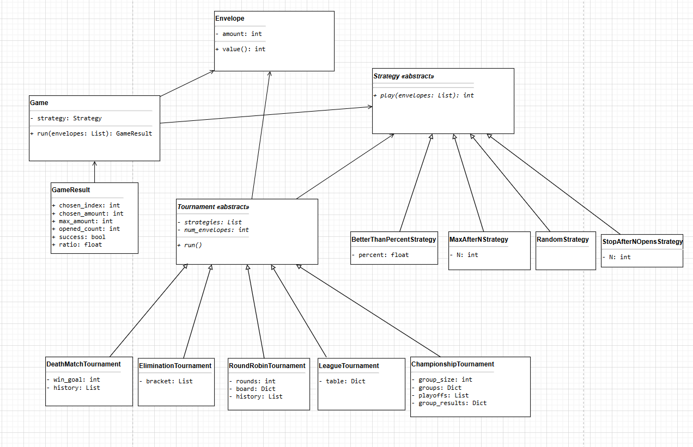

# The-Money-Envelopes-Tournament

## What is this project?
This project is a *game simulator*.  
We imagine many envelopes, each with some random amount of money inside.  
Different *strategies* (ways of choosing) try to pick the best envelope.  

We then play many *tournaments* to see which strategy is the smartest.

## UML



## How the project is built
- *envelope.py* - makes an envelope with a random amount of money.  
- *strategy.py* - has different strategies, for example:  
  - *RandomStrategy* - just picks one at random.  
  - *StopAfterNOpensStrategy* - always picks the N-th envelope.  
  - *BetterThanPercentStrategy* - looks at the first X% of envelopes, then picks the first better one.  
  - *MaxAfterNStrategy* - watches N envelopes, then picks the first bigger one.  
- *game.py* - runs one game for one strategy and shows the result.  
- *Tournaments*:  
  - *RoundRobinTournament* - everyone plays against everyone.  
  - *DeathMatchTournament* - two strategies, first to reach a win goal.  
  - *EliminationTournament* - knockout, losers go home.  
  - *LeagueTournament* - like a sports league with a table.  
  - *ChampionshipTournament* - group stage + playoffs.  
- *simluations.py* - main program. Runs many tournaments and saves results in CSV and JSON.

---

## How to run
1. Make sure you have *Python 3* installed.  
2. In the project folder, run:
   ```bash
   python simluations.py
   ```